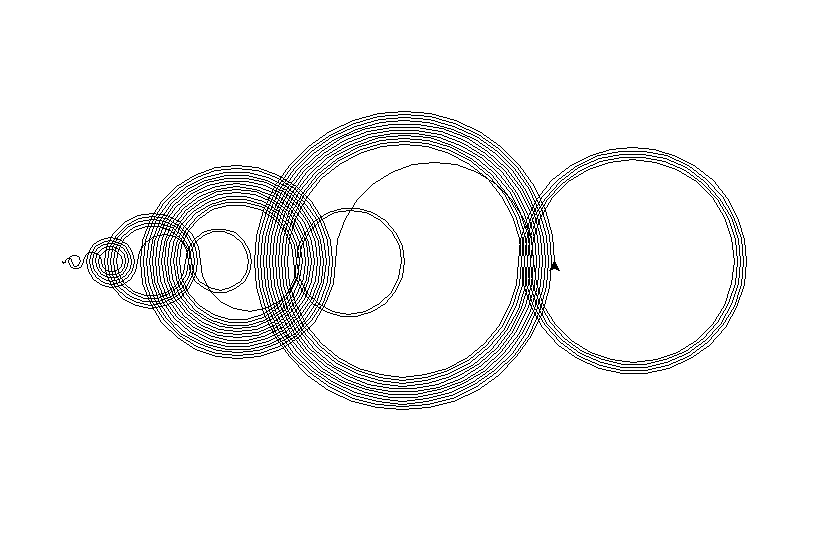

# recaman

Visualize Recamán's sequence.

## Table of Contents

-   [About](#about)
-   [Getting Started](#getting-started)
    -   [Prerequisites](#prerequisites)
    -   [Initial setup](#initial-setup)
-   [Distributing](#distributing)
-   [Contributing](#contributing)
-   [Versioning](#versioning)
-   [Authors](#authors)
-   [License](#license)
-   [See also](#see-also)
-   [Acknowledgments](#acknowledgments)

## About

`0, 1, 3, 6, 2, 7, 13, 20, 12, 21, 11, 22, 10, 23, 9, 24, ...`

Recamán's sequence ([A005132](https://oeis.org/A005132) in the OIES) was
invented by Bernardo Recamán. It is generated with a simple rule:

> "subtract if possible, otherwise add".

Let's look at an example:

1. We start with `0` and our step `1`
2. `0 - 1` is `-1` so we add `1` and get the sequence `0, 1`
3. We increment the step by one
4. `1 - 2` is `-1` so we add `2` and get the sequence `0, 1, 3`
5. and so on...

For a good video-explanation, see [The Slightly Spooky Recamán Sequence](https://www.youtube.com/watch?v=FGC5TdIiT9U) from Numberphile.

Formally, the sequence is defined as follows:


with a<sub>0</sub> = 0

By drawing semi-circles to the according terms of the sequence, we receive a
nice visualization:



## Getting Started

These instructions will get you a copy of the project up and running on your
local machine for development and testing purposes.

### Prerequisites

You will need python3 and pip3 installed on your machine. You can install it
from the official website https://www.python.org/. You will also need Tk
support. See https://docs.python.org/3/library/tkinter.html for more
information.

### Initial setup

A step by step series of examples that tell you how to get a virtual python
environment running:

Create your virtual environment:

```bash
python3 -m venv venv
```

Then activate your virtual environment:

```bash
source venv/bin/activate
```

To exit the virtual environment run

```bash
deactivate
```

## Distributing

### Installing

To get started, activate the virtual environment:

```bash
source venv/bin/activate
```

Install the packages from `requirements.txt`:

```bash
pip3 install -r requirements.txt
```

### Installing additional packages

After activating the virtual environment, install your package(s)

```bash
pip3 install <package>
```

Then freeze your packages

```bash
pip3 freeze > requirements.txt
```

## Contributing

Please read [CONTRIBUTING.md](CONTRIBUTING.md) and
[CODE_OF_CONDUCT.md](CODE_OF_CONDUCT.md) for details on our code of conduct, and
the process for submitting pull requests to us.

## Versioning

We use [SemVer](http://semver.org/) for versioning. For the versions available,
see the [tags on this repository](https://github.com/umcconnell/recaman/tags).

## Authors

Ulysse McConnell - [umcconnell](https://github.com/umcconnell/)

See also the list of
[contributors](https://github.com/umcconnell/recaman/contributors)
who participated in this project.

## License

This project is licensed under the MIT License - see the
[LICENSE.md](LICENSE.md) file for details.

## See also

## Acknowledgments

-   [The Slightly Spooky Recamán Sequence - Numberphile](https://www.youtube.com/watch?v=FGC5TdIiT9U)
-   [Recamán's Sequence - Wolfram MathWorld](http://mathworld.wolfram.com/RecamansSequence.html)
-   [A005132 - OIES](https://oeis.org/A005132)
-   [Sequence - Wikipedia](https://en.wikipedia.org/wiki/Sequence#Defining_a_sequence_by_recursion)
